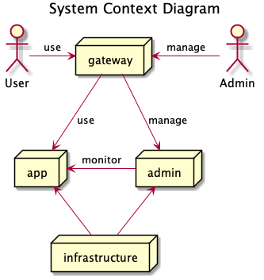
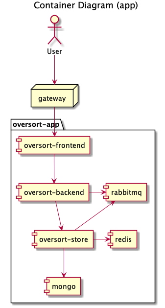
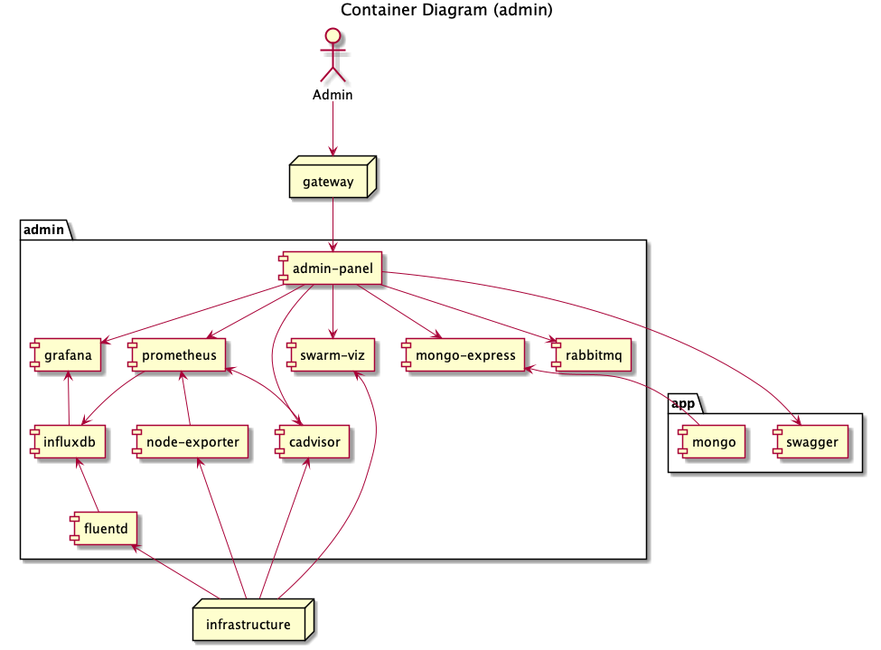
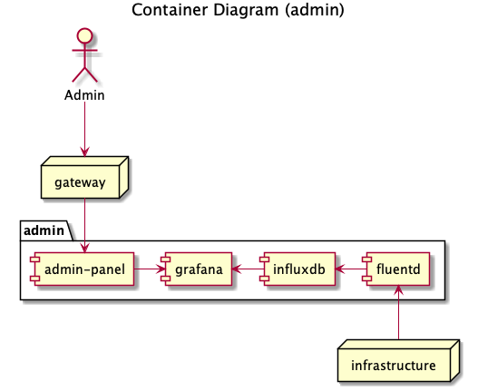
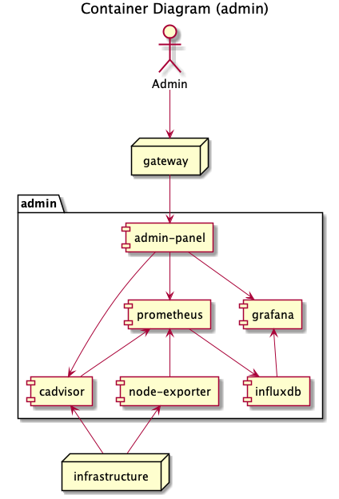
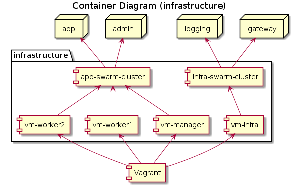

# Architecture

# Architecture

## System's Architecture Overview

There are two parts of the system:
- **app** - all microservices required to provide sorting feature
- **admin** - services that monitor and manage *app* components and the **infrastructure**

All user interfaces of both: **app** and **admin** are available through the **web gateway** (available at http://192.168.10.100).

## Sorting Microservices Design

The main application is split into several components. The frontend UI and the API are available through **web gateway** at http://192.168.10.100

Component          | Description
-------------------|--------------------------------------------------------
oversort-frontend  | web server that host web UI containing sorting form
oversort-backend   | provides API gateway for backend services and orchiestrate them
oversort-store     | keeps historical results of sorting
mongo              | database where all sorting operations are stored
redis              | cache used to optimize queries to oversort-store
rabbitmq           | message queue that transport sort operation

## Administration and Monitoring

A set of services is provided to manage the main application and the infrastructure where it runs. All UI's of administration services are available through **web gateway** at http://192.168.10.100/admin. Usually, each of those services provides separate UI. All of them are integrated by **admin-panel** component that provides proper routing and linking by embedding UI of other administration services.

### Log Management
Logs from docker images are forwarded to **fluentd** log collector and stored in **influxdb**. One of **Grafana** dashboards is configured to display collected logs. Grafana is available through the **admin-panel**.

### Swarm Cluster Monitoring
**Grafana** displays performance statistics of all services. It connects to **influxdb** to get the data. Performance metrics are provided by **Prometheus**, which collects them from **node-exporter** and **cAdvisor**. UI of **Grafana**, **cAdvisor** instances and **Prometheus** are available through the **admin-panel**.

## Infrastructure
The system runs on 4 Virtual Machines, where two Docker Swarm clusters are spawn: **app-swarm-cluster** and **infra-swarm-cluster**. Infra cluster must be started before the app cluster since **fluentd** log collector is hosted there, and all app containers depend on it. Infra cluster hosts also **web-gateway**, which is the first load balancer and route traffic between the app and administration services.

